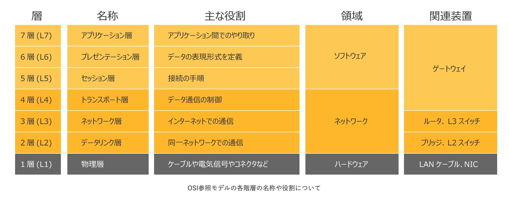
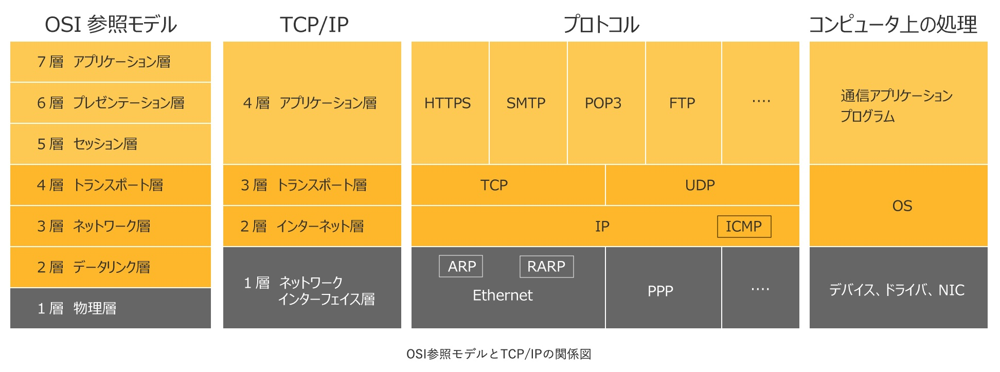
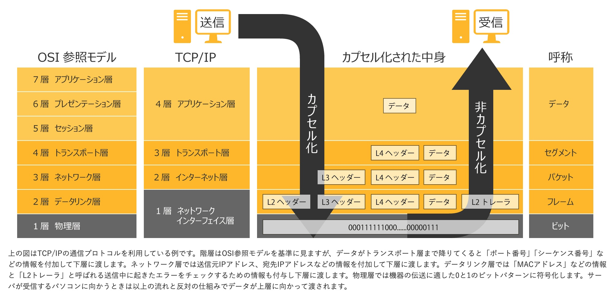
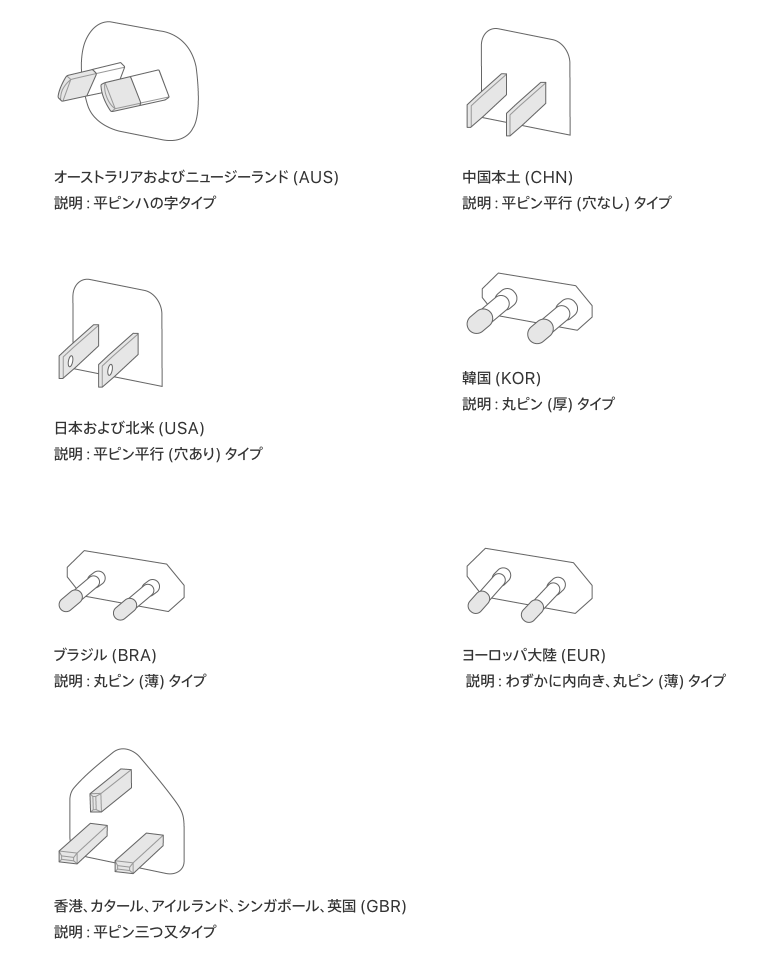
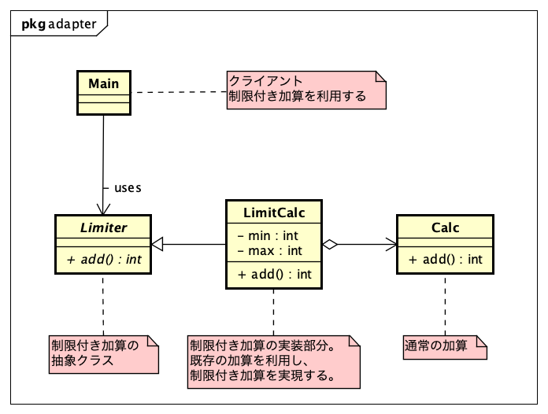
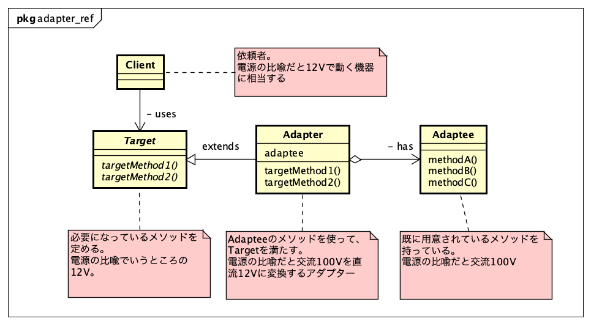
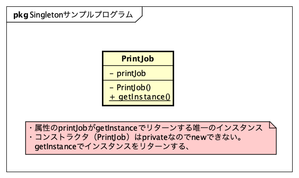

# 【連続講座1】デザインパターンを学び、ソフトウェア設計に生かそう
Adapter・Factory Method・Singleton

パーソルクロステクノロジー株式会社
エンジニアリング事業管掌　設計統括本部
第2電子・制御設計本部　第1設計部　4G　阿部耕二

<!--
_class: lead
_paginate: false
_header: ""
footer: ""
-->

# 目次
- 自己紹介
- 開発環境構築
- 設計、してますか?
- 良い設計とはどういう設計か?
- デザインパターンの学び方のススメ
- Adapter
- Factory Method
- Singleton
- 参考資料

<!--
_header: ""
_footer: "" 
-->

# 自己紹介
- 名前: 阿部　耕二（あべ　こうじ）
- 所属: パーソルクロステクノロジー株式会社
エンジニアリング事業管掌　設計統括本部
第2電子・制御設計本部　第1設計部　4G
- 医療機器の組込みソフトウェア開発。C言語。
- 趣味: 宇宙開発（[リーマンサットプロジェクト](https://www.rymansat.com/)広報メンバー）
- LAPRASポートフォリオ: https://lapras.com/public/k-abe
- Twitter: [@juraruming](https://x.com/juraruming)

# 開発環境構築
<!--
_footer: "" 
-->
サンプルコードのコンパイル、実行にjava（JDK）のインストールが必要です。下記のページなどを参照し、ご自分のPCのOSに合わせてインストールしてください。

[【2024年版】Java JDKのインストール方法（Windows & Mac対応）](https://codeforfun.jp/how-to-install-java-jdk-on-windows-and-mac/)

つぎのコマンド実行でバージョンが表示されていればOKです。
私はつぎのバージョンで確認しました。
```
$ javac -version
javac 17.0.8
```

---
<!--
_footer: "" 
-->
サンプルプログラムのビルド方法
サンプルプログラムのディレクトリ（Main.javaがあるディレクトリ）に移動しつぎのコマンドでビルドする。

```
$ javac Main.java 
```

プログラムの実行はつぎのコマンドで行う。
```
$ java Main 
```

---
<!--
_footer: "" 
-->
* 講座のGitHubリポジトリ
https://github.com/grace2riku/design_pattern_lesson

* 今回の講座のディレクトリ
https://github.com/grace2riku/design_pattern_lesson/tree/main/lesson_1

* 参考資料1　ソースコードのダウンロード先
[Java言語で学ぶデザインパターン入門　第3版](https://www.hyuki.com/dp/)


# 設計、してますか?
<!--
_footer: "" 
-->

**設計してますか?**

---
<!--
_footer: "" 
-->
こんなことになってませんか?


[おばあちゃんのプログラミング教室（ばあプロ）As A Service @Pythonist19](https://x.com/Pythonist19)より引用

https://x.com/Pythonist19/status/1845794841269055543

---
<!--
_footer: "" 
-->
* 設計の重要性
  * 要素技術にフォーカスしがち、注力しがち
  →　再利用しにくい、変更しにくいソフトウェアのできあがり
　
* 他社との違い・自社の強みを活かしていないソフトウェアが誕生
  * ビジネス競争力の低下　→　技術的負債に!!!

---
<!--
_footer: "" 
-->
* 設計の難しさ
  * お手本がない。
    * 対象製品、装置で個別の事情がある。
    * 製品の特性、開発期間、製品寿命、etc
      * Webシステムと組込みソフトウェア
      * 自動車と医療機器では設計思想も違ってきそう。
        * 自動車：変化が早い、開発期間短い、大量生産
        * 医療機器：開発期間長い印象、少量生産

  * ソフトウェアは柔軟で、自由度が高すぎる。

---
<!--
_footer: "" 
-->
* 対象システム、装置に応じた設計手法を学び、身につける
そしてチームメンバーと共通認識を持ちたい。

**デザインパターン**

* 設計の古典、教科書ともいえる。
* プログラミング言語の中に取り込まれて、見えない。
　
　→　学ぶことは意味があると考える。
　→　開発時のコミュニケーションに活用する。
　ここは「xxx」パターンを適用してみようか?

# 良い設計とはどういう設計か?
<!--
_footer: "" 
-->
良い設計のために個人的に大事だと思うキーワード

1. 凝集度
2. 結合度
3. 関心の分離

## 1. 凝集度
<!--
_footer: "" 
-->
* 関心ごとの集まり
* 凝集度が高い方（関心ごとが一箇所に集まっている）が良い設計と言われる
* 1つの目的・責務になっていることが望ましい

キッチンで料理を作る場面
キッチン周りには料理に必要な設備が配置される（水道、冷蔵庫、コンロ、食器棚、その他）。
→必要なものが凝集している状態

キッチン周りに洗濯機はいらない。
料理をつくるという関心ごとに洗濯機は不要。

## 2. 結合度
<!--
_footer: "" 
-->
* 他のモジュールとの関連の度合い
* 結合度が低い方（他のモジュールとの関連が少ない方）が良い設計と言われる


## 3. 関心の分離
<!--
_footer: "" 
-->
* 関心ごとを分離し、境界を設ける
* 関心の分離が表現されている例としてOSI参照モデル・TCP/IPに注目する

> 画像引用元
[OSI参照モデルとは？TCP/IPとの違いを図解で解説](https://www.itmanage.co.jp/column/osi-reference-model/)

---
<!--
_footer: "" 
-->


* 役割ごとに階層が分かれている
* 下の層がハードウェアに近い

---
<!--
_footer: "" 
-->



---
<!--
_footer: "" 
-->


* 上の階層ほど抽象的。目的・知識・Why。
* 下の階層ほど具体的。目的を達成する手段・How。

# デザインパターンの学び方のススメ
<!--
_footer: "" 
-->
* デザインパターンがどんな課題を解決できて、どのような構成なのかイメージを捉える
  * 参考資料1の章題はデザインパターンを短く端的に表現している。
  * 参考資料3では各デザインパターンを短く、わかりやすく解説してくれている。

---
<!--
_footer: "" 
-->
* クラス図とコードの写経をセットで行う
  * コードだけ見ていても各クラスの全体の関係性がわかりずらい。クラス図だけを見ていても抽象的で本当に動くのか疑問がわく。

  * 今回のサンプルコードはJava。デザインパターンの考え方・実装は特定のプログラミング言語に限定されないと思うので自分が得意な言語で実装してみると理解が深まると思う。
  参考資料2ではC#、 C++、 Go、 Java、 PHP、 Python、 Ruby、 Rust、 Swift、 TypeScriptで実装例を提示してくれている。

* デザインパターンに登場するクラスの相互関係に注目する
  * 複数のクラスが関係してパターンを構成している。各クラスの役割、関係性に注目する。


# Adapter
<!--
_footer: "" 
-->
* 参考資料1　章題　【一皮かぶせて再利用】
* すでに提供されているものがそのまま使えないときに、必要な形に変換してから利用する
* パソコンのACアダプター（直流12Vで動く製品とする）
提供されているもの -> 交流100V
ACアダプタが変換するもの -> 交流を直流に変換。交流100Vをパソコンが動作する12Vに変換する

---
<!--
_footer: "" 
-->
▪️例）Apple ACアダプタ

AppleのACアダプタの構造


---
<!--
_footer: "" 
-->
アダプタのプラグ部分は取り外し可能で海外でも使えるように考慮されている（設計した）と予想できる。
調べてみたら[Apple ワールドトラベルアダプタキット](https://support.apple.com/ja-jp/HT202114)なる製品があり、7種類のプラグ形状があることがわかった。
プラグ部分を容易に変更できる構造になっている。



**このように容易に変更できる構造をソフトウェアにも持ち込みたい!!!**

---
<!--
_footer: "" 
-->
Adapterパターンのサンプルプログラム例

テーマ：既にある加算に下限・上限の制限を追加する。
例えば、下限O、上限100のときに加算の計算結果が上限値を超えたら上限値の100にする。
加算の計算結果が下限値を下回ったら下限値の0に固定する。

表 電源の比喩とサンプルプログラムの対応関係

| \ | 電源の比喩 | サンプルプログラム |
| :--- | :--- | :--- |
| 提供されているもの | 交流100ボルト | Calcクラス | 
| 変換装置 | アダプター | LimitCalcクラス |
| 必要なもの | 直流12ボルト | Limiterクラス |

---
<!--
_footer: "" 
-->
サンプルプログラムのクラス図



サンプルプログラムのディレクトリ
https://github.com/grace2riku/design_pattern_lesson/tree/main/lesson_1/adapter/LimitCalc

---
<!--
_footer: "" 
-->
サンプルプログラムのビルド方法
サンプルプログラムのディレクトリ（Main.javaがあるディレクトリ）に移動しつぎのコマンドでビルドする。

```
$ javac Main.java 
```

プログラムの実行はつぎのコマンドで行う。
```
$ java Main 
```

---
<!--
_footer: "" 
-->
Adapterサンプルプログラムの実行結果

```
$ java Main
/***** Calc *****/
ret_val(0 + 101) = 101
ret_val(0 + (-1)) = -1

/***** LimitCalc *****/
limit min value = 0/limit max value = 100
ret_val(0 + 50) = 50
ret_val(0 + 100) = 100
ret_val(0 + 101) = 100
ret_val(0 + 0) = 0
ret_val(0 + (-1)) = 0
```

* Calcはリミットなしの加算。LimitCalcはリミットありの加算
* LimintCalcの下限は0、上限は100に設定

---
<!--
_footer: "" 
-->
Adapterパターンの登場人物を抽象的に書く



---
<!--
_footer: "" 
-->
Adapterパターンの使いところ

* 既にあるクラスを変更せずに再利用できる
* 変動部（Target）をバリエーション化すれば素早く多くのバリエーションに対応できる（競合他社との差別化）


# Factory Method
<!--
_footer: "" 
-->
* 参考資料1　章題　【インスタンス作成をサブクラスにまかせる】
* インスタンス作成するクラスを用意する（あちこちでインスタン作成せずに、インスタンス作成役に任せる）。

---
<!--
_footer: "" 
-->
サンプルプログラムのクラス図


サンプルプログラムのディレクトリ
https://github.com/grace2riku/design_pattern_lesson/tree/main/lesson_1/Factory_Method

---
<!--
_footer: "" 
-->
サンプルプログラムのビルド方法
サンプルプログラムのディレクトリ（Main.javaがあるディレクトリ）に移動しつぎのコマンドでビルドする。

```
$ javac Main.java 
```

プログラムの実行はつぎのコマンドで行う。
```
$ java Main 
```

---
<!--
_footer: "" 
-->
Adapterサンプルプログラムの実行結果

```
$ java Main
/***** IDCardのFactory *****/
Hiroshi Yukiのカードを作ります。
IDCard [owner=Hiroshi Yuki]を登録しました。
Tomuraのカードを作ります。
IDCard [owner=Tomura]を登録しました。
Hanako Satoのカードを作ります。
IDCard [owner=Hanako Sato]を登録しました。
IDCard [owner=Hiroshi Yuki]を使います。
IDCard [owner=Tomura]を使います。
IDCard [owner=Hanako Sato]を使います。

/***** BussinesCardのFactory *****/
Koji Abeの名刺を作ります。
BusinessCard [owner=Koji Abe]を登録しました。
Riku Abeの名刺を作ります。
BusinessCard [owner=Riku Abe]を登録しました。
BusinessCard [owner=Koji Abe]を使います。
BusinessCard [owner=Riku Abe]を使います。
```

---
<!--
_footer: "" 
-->
Adapterサンプルプログラムの実行結果

* IDCardのFactoryは参考資料1のサンプルコード
* BussinesCardのFactoryは今回追加した名刺のFactoryと商品の名刺
* フレームワークのパッケージ内は変更せず、具体的な工場・商品の追加で新しい種類のインスタンス作成ができた

---
<!--
_footer: "" 
-->
Factory_Methodパターンの登場人物を抽象的に書く


---
<!--
_footer: "" 
-->
Factory_Methodパターンの使いところ

* インスタンス生成を専門にするクラスを用意することでコードを整理できる
工場に使えばインスタンスを作成できる。

---
<!--
_footer: "" 
-->
static Factory Method
> 参考資料1より引用

* インスタンス生成のためのクラスメソッド（クラスをインスタンス化しなくても呼び出し可能なメソッド）

* GoFのFactory Methodパターン違うが、インスタンス生成でよく使われる手法。
（個人的に開発シーンでFactoryと呼ぶときはこちらを指すことが多いと思っている）

---
<!--
_footer: "" 
-->
static Factory Method

* javaのAPIのstatic Factory Methodとして参考資料1で紹介されているものは以下のとおり
  * java.security.SecureRandomのgetInstanceメソッド
  * java.util.Listのofメソッド 
  * java.util.ArraysのasListメソッド 
  * java.lang.StringのvalueOfメソッド 
  * java.time.Instantのnowメソッド 


# Singleton
<!--
_footer: "" 
-->
* 参考資料1　章題　【たった1つのインスタンス】
* システムにインスタンスが1つしかないことを保証する。
プログラマがインスタンスを1つしかつくらないように気を付けるのではなく、インスタンスが1つしかつくれないような仕組みにする。

---
<!--
_footer: "" 
-->
システムの中で複数あると困りそうなもの

* プリンタのジョブ管理
* デバイスドライバ
* Factory MethodのFactory

---
<!--
_footer: "" 
-->
Singletonパターンのサンプルプログラム例

テーマ：システムに1つのものを対象にする。今回はプリンタのジョブ

---
<!--
_footer: "" 
-->
サンプルプログラムのクラス図



サンプルプログラムのディレクトリ
https://github.com/grace2riku/design_pattern_lesson/tree/main/lesson_1/Singleton/PrintJob


---
<!--
_footer: "" 
-->
サンプルプログラムのビルド方法
サンプルプログラムのディレクトリ（Main.javaがあるディレクトリ）に移動しつぎのコマンドでビルドする。

```
$ javac Main.java 
```

プログラムの実行はつぎのコマンドで行う。
```
$ java Main 
```

---
<!--
_footer: "" 
-->
Singletonサンプルプログラムの実行結果

```
$ java Main
Start.
インスタンスを生成しました。
printjob1とprintjob2は同じインスタンスです。
End.
```

* 「インスタンスを生成しました。」のメッセージが1つなので、インスタンスは1つのみ生成されている。
* getInstanceメソッドで取得したインスタンスは同じことを確認できた

---
<!--
_footer: "" 
-->
Singletonパターンの使いところ

* インスタンスが1つであることを保証したい時
  * 組込みソフトウェアのデバイスドライバなど。
  * データベースのアクセス
  * Factory MethodのFactory


# 参考資料
<!--
_footer: "" 
-->
1. [Java言語で学ぶデザインパターン入門　第3版](https://www.hyuki.com/dp/)
2. [直撃！デザインパターン](https://refactoring.guru/ja/design-patterns/book)
3. [ぼくにもわかるデザインパターン　第2章 GoFパターン大カタログ ～パターンがみるみる頭にしみこむ～](https://www.ulsystems.co.jp/archives/028.html)


---

ご清聴ありがとうございました🙇