# 【連続講座2】デザインパターンを学び、ソフトウェア設計に生かそう
Builder・Strategy・Composite

パーソルクロステクノロジー株式会社
エンジニアリング事業管掌　設計統括本部
第2電子・制御設計本部　第1設計部　4G　阿部耕二

<!--
_class: lead
_paginate: false
_header: ""
footer: ""
-->

# 目次
- 自己紹介
- 開発環境構築
- 設計、してますか?
- 良い設計とはどういう設計か?
- デザインパターンの学び方のススメ
- Builder
- Strategy
- Composite
- 参考資料

<!--
_header: ""
_footer: "" 
-->

# 自己紹介
- 名前: 阿部　耕二（あべ　こうじ）
- 所属: パーソルクロステクノロジー株式会社
エンジニアリング事業管掌　設計統括本部
第2電子・制御設計本部　第1設計部　4G
- 医療機器の組込みソフトウェア開発。C言語。
- 趣味: 宇宙開発（[リーマンサットプロジェクト](https://www.rymansat.com/)広報メンバー）
- LAPRASポートフォリオ: https://lapras.com/public/k-abe
- Twitter: [@juraruming](https://x.com/juraruming)

# 開発環境構築
<!--
_footer: "" 
-->
サンプルコードのコンパイル、実行にjava（JDK）のインストールが必要です。
下記のページなどを参照し、ご自分のPCのOSに合わせてインストールしてください。

[【2024年版】Java JDKのインストール方法（Windows & Mac対応）](https://codeforfun.jp/how-to-install-java-jdk-on-windows-and-mac/)

---
<!--
_footer: "" 
-->
つぎのコマンド実行でバージョンが表示されていればOKです。
私はつぎのバージョンで確認しました。
```
$ javac -version
javac 17.0.8
```

---
<!--
_footer: "" 
-->
サンプルプログラムのビルド方法
サンプルプログラムのディレクトリ（Main.javaがあるディレクトリ）に移動しつぎのコマンドでビルドする。

```
$ javac Main.java 
```

プログラムの実行はつぎのコマンドで行う。
```
$ java Main 
```

---
<!--
_footer: "" 
-->
* 講座のGitHubリポジトリ
https://github.com/grace2riku/design_pattern_lesson

* 今回の講座のディレクトリ
https://github.com/grace2riku/design_pattern_lesson/tree/main/lesson_2

* 参考資料1　ソースコードのダウンロード先
[Java言語で学ぶデザインパターン入門　第3版](https://www.hyuki.com/dp/)


# 設計、してますか?
<!--
_footer: "" 
-->

**設計してますか?**

---
<!--
_footer: "" 
-->
こんなことになってませんか?


[おばあちゃんのプログラミング教室（ばあプロ）As A Service @Pythonist19](https://x.com/Pythonist19)より引用

https://x.com/Pythonist19/status/1845794841269055543

---
<!--
_footer: "" 
-->
* 設計の重要性
  * 要素技術にフォーカスしがち、注力しがち
  →　再利用しにくい、変更しにくいソフトウェアのできあがり
　
* 他社との違い・自社の強みを活かしていないソフトウェアが誕生
  * ビジネス競争力の低下　→　技術的負債に!!!

---
<!--
_footer: "" 
-->
* 設計の難しさ
  * お手本がない。
    * 対象製品、装置で個別の事情がある。
    * 製品の特性、開発期間、製品寿命、etc
      * Webシステムと組込みソフトウェア
      * 自動車と医療機器では設計思想も違ってきそう。
        * 自動車：変化が早い、開発期間短い、大量生産
        * 医療機器：開発期間長い印象、少量生産

  * ソフトウェアは柔軟で、自由度が高すぎる。

---
<!--
_footer: "" 
-->
* 対象システム、装置に応じた設計手法を学び、身につける
そしてチームメンバーと共通認識を持ちたい。

**デザインパターン**

* 設計の古典、教科書ともいえる。
* プログラミング言語の中に取り込まれて、見えない。
　
　→　学ぶことは意味があると考える。
　→　開発時のコミュニケーションに活用する。
　ここは「xxx」パターンを適用してみようか?

# 良い設計とはどういう設計か?
<!--
_footer: "" 
-->
良い設計のために個人的に大事だと思うキーワード

1. 凝集度
2. 結合度
3. 関心の分離

## 1. 凝集度
<!--
_footer: "" 
-->
* 関心ごとの集まり
* 凝集度が高い方（関心ごとが一箇所に集まっている）が良い設計と言われる
* 1つの目的・責務になっていることが望ましい

例）料理を作る場面
キッチン周りには料理に必要な設備が配置される（水道、冷蔵庫、コンロ、食器棚、その他）。
→必要なものが凝集している状態
キッチン周りに洗濯機はいらない。料理をつくるという関心ごとに洗濯機は不要。

## 2. 結合度
<!--
_footer: "" 
-->
* 他のモジュールとの関連の度合い
* 結合度が低い方（他のモジュールとの関連が少ない方）が良い設計と言われる
* あるファイルのグローバル変数が他の複数のファイルから参照されている状況は結合度が低い。

## 3. 関心の分離
<!--
_footer: "" 
-->
* 関心ごとを分離し、境界を設ける
* 関心の分離が表現されている例としてOSI参照モデル・TCP/IPに注目する

> 画像引用元
[OSI参照モデルとは？TCP/IPとの違いを図解で解説](https://www.itmanage.co.jp/column/osi-reference-model/)

---
<!--
_footer: "" 
-->


* 役割ごとに階層が分かれている
* 下の層がハードウェアに近い

---
<!--
_footer: "" 
-->


---
<!--
_footer: "" 
-->


* 上の階層ほど抽象的。目的・知識・Why。
* 下の階層ほど具体的。目的を達成する手段・How。

# デザインパターンの学び方のススメ
<!--
_footer: "" 
-->
* デザインパターンがどんな課題を解決できて、どのような構成なのかイメージを捉える
  * 参考資料1の章題はデザインパターンを短く端的に表現している。
  * 参考資料3では各デザインパターンを短く、わかりやすく解説してくれている。

---
<!--
_footer: "" 
-->
* クラス図とコードの写経をセットで行う
  * コードだけ見ていても各クラスの全体の関係性がわかりずらい。クラス図だけを見ていても抽象的で本当に動くのか疑問がわく。

  * 設計図（抽象）　⇔　コード（具体的）の世界を行ったり来たりすることで整理できたり、気づきが得られることがあると思う。

  * 今回のサンプルコードはJava。デザインパターンの考え方・実装は特定のプログラミング言語に限定されないと思うので自分が得意な言語で実装してみると理解が深まると思う。
  参考資料2ではC#、 C++、 Go、 Java、 PHP、 Python、 Ruby、 Rust、 Swift、 TypeScriptで実装例を提示してくれている。

---
<!--
_footer: "" 
-->
* デザインパターンに登場するクラスの相互関係に注目する
  * 複数のクラスが関係してパターンを構成している。各クラスの役割、関係性に注目する。

* デザインパターンがどのように振る舞うか?に加えて、デザインパターンはどのように使われるか?の視点も大事だと思う。

# Builder
<!--
_footer: "" 
-->
* 参考資料1　章題　【複雑なインスタンスを組み立てる】
* 複雑な構造をもったものを作り上げるとき、一気に完成させるのは難しい。
全体を構成している各部分を作り、段階を踏んで組み上げていく。

---
<!--
_footer: "" 
-->
サンプルプログラム例

テーマ：参考資料1の「文書」を作成するプログラム。
文書は以下のような構造をもつ。

* タイトルを1つ含む
* 文字列をいくつか含む
* 箇条書きの項目をいくつか含む

参考資料1 サンプルプログラムでテキスト・HTMLの文書をつくるのに加え、マークダウンで文書をつくるクラスを追加する。


---
<!--
_footer: "" 
-->
サンプルプログラムのクラス図

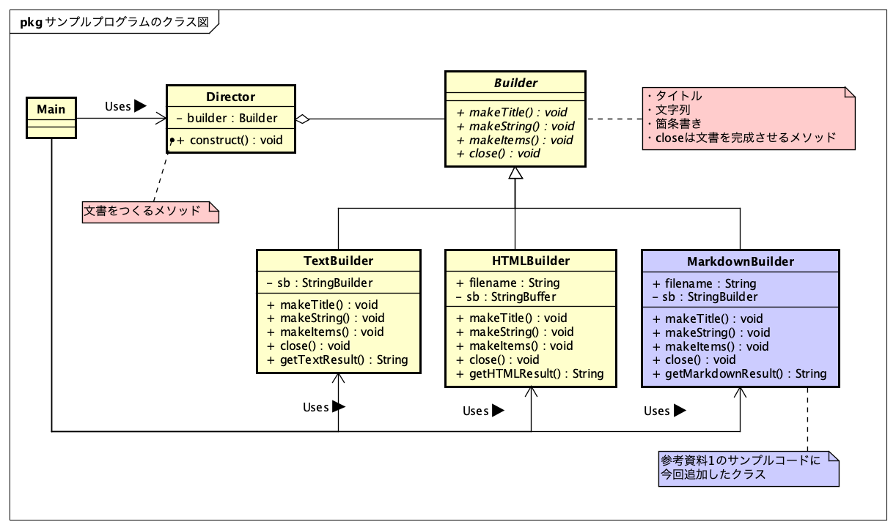

サンプルプログラムのディレクトリ
https://github.com/grace2riku/design_pattern_lesson/tree/main/lesson_2/Builder

---
<!--
_footer: "" 
-->
サンプルプログラムの解説
* Builderクラスは文章を構成するメソッドを定義する。
具体的な処理はサブクラスに書かれている。文章の種類の違いはサブクラスの中で表現されている。
* Directorクラスのconstructメソッドで文章を作成する。


---
<!--
_footer: "" 
-->
Directorクラスのconstructメソッドは文章の種類に関わらず同じ処理で文章を作成している。
```java:Director.java
    public void construct() {
        builder.makeTitle("Greeting");
        builder.makeString("一般的なあいさつ");
        builder.makeItems(new String[]{
            "How are you?",
            "Hello.",
            "Hi.",
        });
        builder.makeString("時間帯に応じたあいさつ");
        builder.makeItems(new String[]{
            "Good morning.",
            "Good afternoon.",
            "Good evening.",
        });
        builder.close();
    }
```

---
<!--
_footer: "" 
-->
* Builderクラスの具象クラス（TextBuilder, HTMLBuilder, MarkdownBuilder）のメソッド（makeTitle, makeString, makeItems, close）はメソッド名が同じ。
* 各具象クラスでメソッドの処理は異なる。

---
<!--
_footer: "" 
-->
サンプルプログラムのビルド方法
サンプルプログラムのディレクトリ（Main.javaがあるディレクトリ）に移動しつぎのコマンドでビルドする。

```
$ javac Main.java 
```

プログラム実行時は引数で作成する文書を指定する（Main.javaを参照）。

---
<!--
_footer: "" 
-->
テキストの場合
```
$ java Main text
```

HTMLの場合
```
$ java Main html
```

マークダウンの場合
```
$ java Main md
```

---
<!--
_footer: "" 
-->
サンプルプログラムの実行結果（テキストの場合）
```
$ java Main text
==============================
『Greeting』

■一般的なあいさつ

　・How are you?
　・Hello.
　・Hi.

■時間帯に応じたあいさつ

　・Good morning.
　・Good afternoon.
　・Good evening.

==============================
```

---
<!--
_footer: "" 
-->
サンプルプログラムの実行結果（HTMLの場合）
```
$ java Main html
HTMLファイルGreeting.htmlが作成されました。
```

HTMLファイルが作成される。
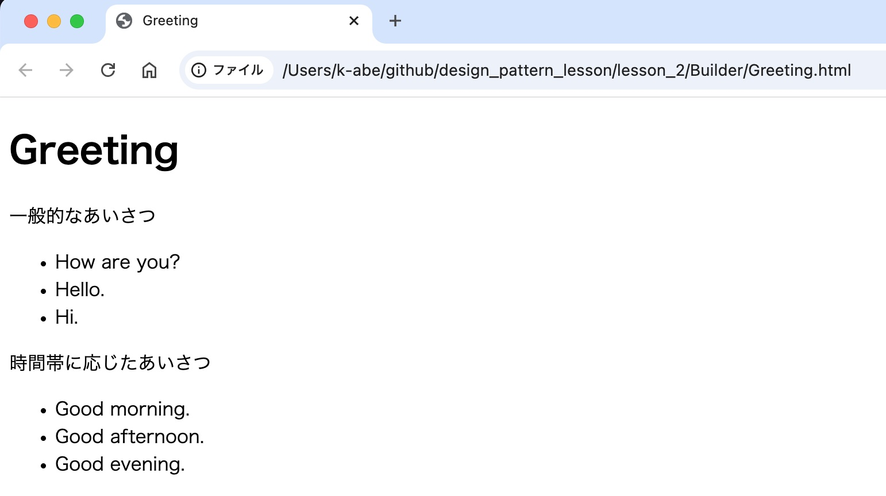

---
<!--
_footer: "" 
-->
サンプルプログラムの実行結果（マークダウンの場合）
```
$ java Main md
MarkdownファイルGreeting.mdが作成されました。
```

マークダウンファイルが作成される。
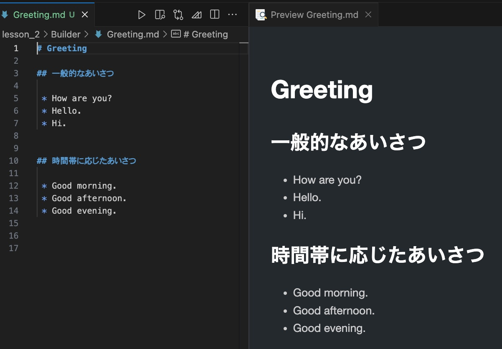

---
<!--
_footer: "" 
-->
Builderパターンの登場人物を抽象的に書く

Builderパターンのクラス図
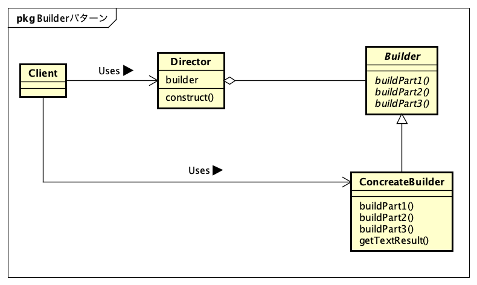

---
<!--
_footer: "" 
-->
Builderパターンのシーケンス図
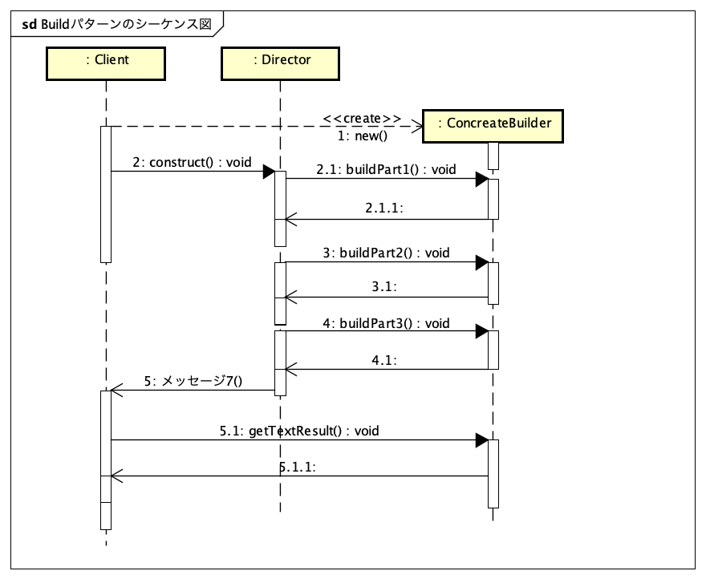


---
<!--
_footer: "" 
-->
Builderパターンのまとめ

1. 誰が何を知っているか
2. 依存性の注入（Dependency Injection ≒ DI）

---
<!--
_footer: "" 
-->
1. 誰が何を知っているか
* MainはBuilderクラスのメソッドをしらない。
Directorクラスのconstructメソッドで文章を作れることは知っている。
MainとしてはそれでOK。

* DirectorクラスはBuilderクラスのみをしっている。
Builderクラスのサブクラス（テキスト・HTML・マークダウン）の詳細はしらない。
DirectorクラスはBuiderクラスのメソッドを使っている。

---
<!--
_footer: "" 
-->
Directorクラスはサブクラスの詳細は知らないが、サブクラスを入れ替えることができた。
知らないからこそ入れ替えができる → **部品として利用できる**。

設計者は

* 誰が何を知っているのか
* 知っている必要があるのか

を意識することが大事そう。
これを意識することで交換可能で優れた部品としてのクラスを設計できそう。


---
<!--
_footer: "" 
-->
2. 依存性の注入（Dependency Injection ≒ DI）
* DirectorクラスはBuilderクラスを知っている。Builderのサブクラス（テキストorHTMLorマークダウン）は知らない
　→　依存していない。

* Directorクラスが文章作成するときは、サブクラスのインスタンスが必要となる。Directorクラスを生成するときはサブクラスのインスタンス（テキストorHTMLorマークダウン）を渡している（依存性の注入）。
　→　Directorクラスはサブクラスのインスタンスに依存して動く、と言える。


---
<!--
_footer: "" 
-->
依存性の注入のつかいところ

渡すインスタンスにより動作を変えられる。

例）データベースを使うシステムのテスト
データベースアクセスのコードが何らかの理由で用意できていないとする。しかし、テストは進めたい。
データベースにアクセスする実装のモック（データベースにアクセスせず、期待値を返す）のインスタンスを渡す(依存性を注入する)。

本番コードのデータベースアクセスの実装ができたら渡すインスタンスを変えれば実行するコードを容易に切り替えることが可能。

依存性注入はテストをしやすく技術としても使われている印象。

# Strategy
<!--
_footer: "" 
-->
* 参考資料1　章題　【アルゴリズムをごっそり切り替える】
* Strategy: 戦略という意味
* プログラミングの文脈においての戦略　≒　アルゴリズム
*  アルゴリズムを切り替え、同じ問題を別の方法で解くのを容易にするパターン

---
<!--
_footer: "" 
-->
サンプルプログラムのテーマ
[UMTP 組込みモデリング部会](https://umtp-japan.org/activity-report/6846)

組込みモデリングカタログ
部品編 -> **目標制御** をテーマとする。

モデルの概要
* 制御対象の測定値が目標値となるように制御する仕組み
* 目標制御の適用例
  * エアコンの温度制御
  * 自動車の速度制御
  * その他、多種多様多岐に渡る

---
<!--
_footer: "" 
-->
目標制御のモデル解説

参考資料4. [組込み分野のためのUML モデル解説書 部品編 C001 目標制御](https://umtp-japan.org/pdf/built/C001_TargetControl.pdf) 16ページ

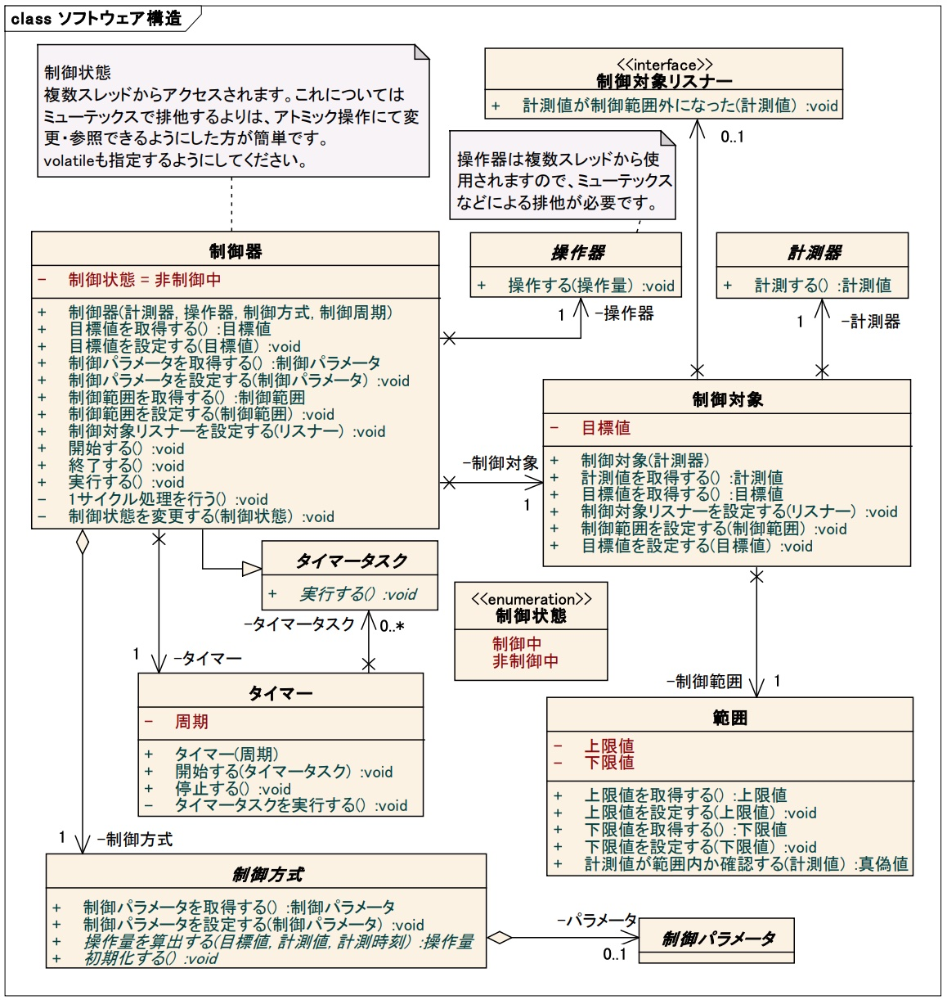

* 目標制御モデルの全体構造

---
<!--
_footer: "" 
-->
目標制御の**制御方式**の解説

参考資料4. [組込み分野のためのUML モデル解説書 部品編 C001 目標制御](https://umtp-japan.org/pdf/built/C001_TargetControl.pdf) 21ページ

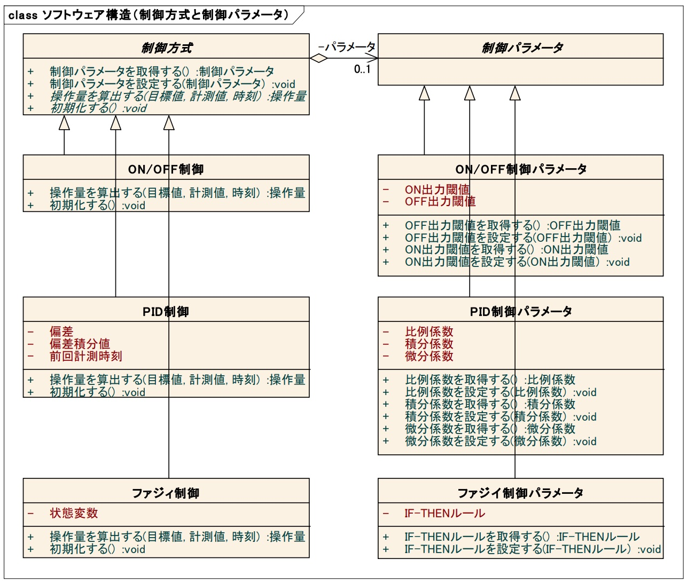

* サンプルプログラムでは制御方式の各制御をStrategyパターンで表現する

---
<!--
_footer: "" 
-->
今回実装したのは図の赤枠のメソッド
* 開始する（start）、初期化（init）
* StrategyパターンでPID制御の部分がON・OFF制御、ファジー制御、機械学習制御のバリエーションになる

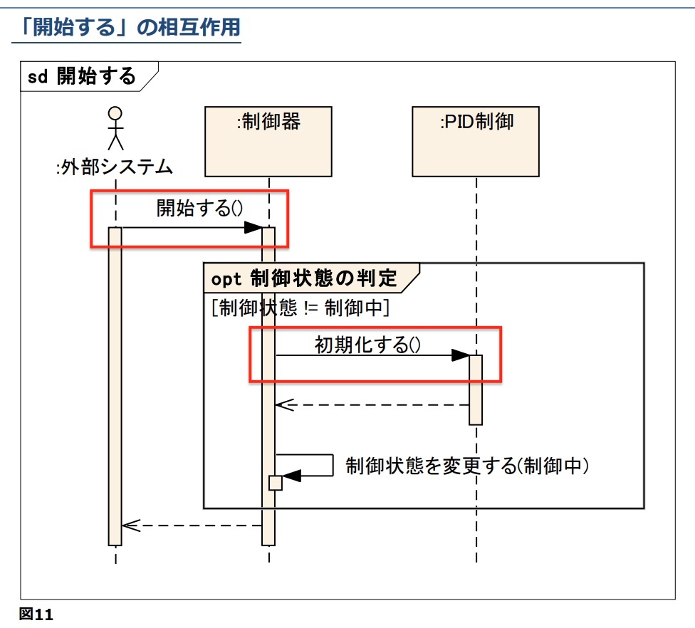

---
<!--
_footer: "" 
-->
今回実装したのは図の赤枠のメソッド
* 実行する（execute）、操作量を算出する（CalcOperationAmount）

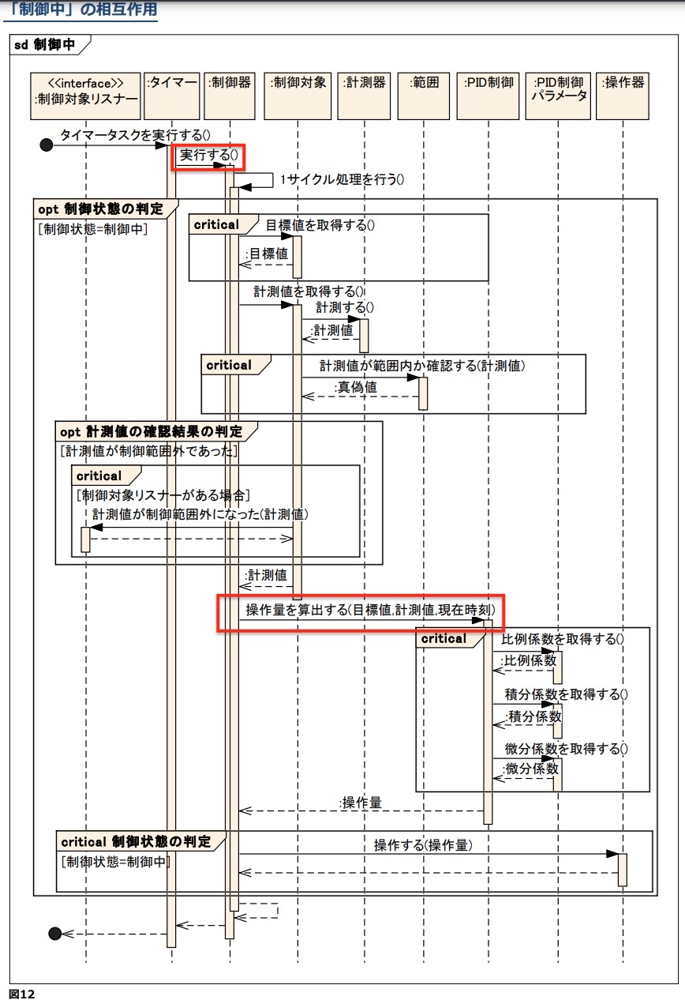

---
<!--
_footer: "" 
-->
今回実装したのは図の赤枠のメソッド
* 終了する（exit）

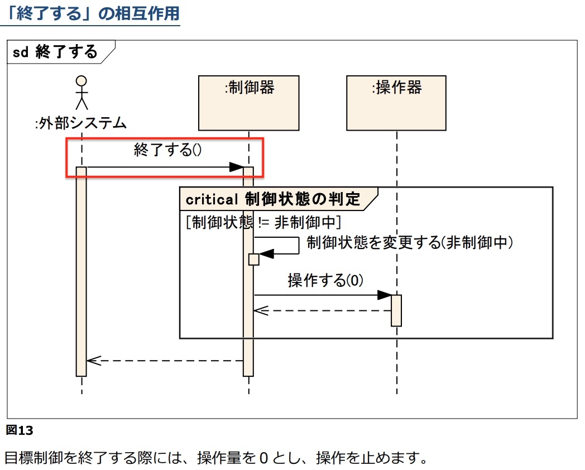


---
<!--
_footer: "" 
-->
サンプルプログラムのクラス図

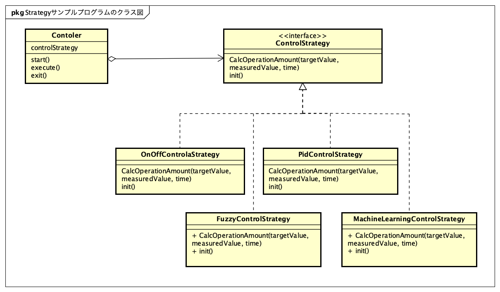

サンプルプログラムのディレクトリ
https://github.com/grace2riku/design_pattern_lesson/tree/main/lesson_2/Strategy

---
<!--
_footer: "" 
-->
各制御方式の詳細
> 参考資料4. [組込み分野のためのUML モデル解説書 部品編 C001 目標制御](https://umtp-japan.org/pdf/built/C001_TargetControl.pdf) 34ページより引用

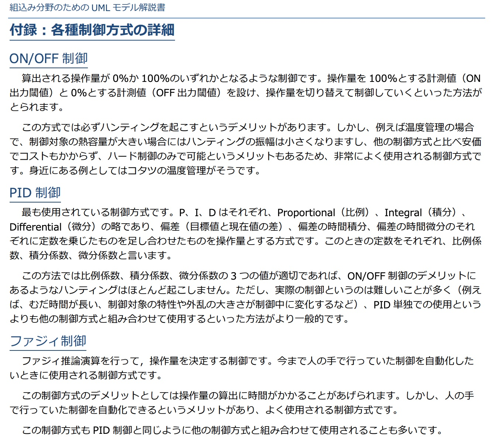


---
<!--
_footer: "" 
-->

Strategyパターンとビジネス活動の連携の例

| 制御方式 | 実装コスト | 将来性 | Strategy適用例 |
| :--- | :--- | :--- | :--- |
| ON・OFF制御 | 低 | × | 社内ハード屋さん確認用にすぐリリースする |
| PID制御 | 中 | × | 1stリリース |
| ファジィ制御 | 高 | △ | 2ndリリース |
| 機械学習制御 | 中 | ○ | ・販促。AI・機械学習と打ち出すと売れる（かもしれない）<br>・上位機種 |

---
<!--
_footer: "" 
-->
**注意**

* 今回Javaで目標制御のサンプルプログラムを書いたが、あくまでStrategyパターンを学ぶためのサンプルプログラム
* ガベージコレクションがいつ実行されるかわからないJavaでリアルタイム性が求められる制御を普通はしない。

---
<!--
_footer: "" 
-->
サンプルプログラムのビルド方法
サンプルプログラムのディレクトリ（Main.javaがあるディレクトリ）に移動しつぎのコマンドでビルドする。

```
$ javac Main.java 
```

プログラムの実行は制御方式の引数を指定する（つぎはON・OFF制御の場合）。
```
$ java Main onoff
```

---
<!--
_footer: "" 
-->
制御方式の引数の組合せ

| 制御方式 | 引数 | コマンド |
| :--- | :--- | :--- |
| ON・OFF制御 | onoff | java Main onoff |
| PID制御 | pid | java Main pid |
| ファジィ制御 | fuzzy | java Main fuzzy |
| 機械学習制御 | ml | java Main ml |


---
<!--
_footer: "" 
-->
サンプルプログラムの実行結果

ON・OFF制御の実行結果
```
$ java Main onoff
OnOff制御を開始します...
OnOffControlStrategy init
OnOffControlStrategy CalcOperationAmount
```

PID制御の実行結果
```
$ java Main pid
PID制御を開始します...
PidControlStrategy init
PidControlStrategy CalcOperationAmount
```
---
<!--
_footer: "" 
-->

ファジー制御の実行結果
```
$ java Main fuzzy
ファジー制御を開始します...
FuzzyControlStrategy init
FuzzyControlStrategy CalcOperationAmount
```

機械学習制御の実行結果
```
$ java Main ml
機械学習制御を開始します...
MachineLearningControlStrategy init
MachineLearningControlStrategy CalcOperationAmount
```

---
<!--
_footer: "" 
-->
Strategyパターンの登場人物を抽象的に書く

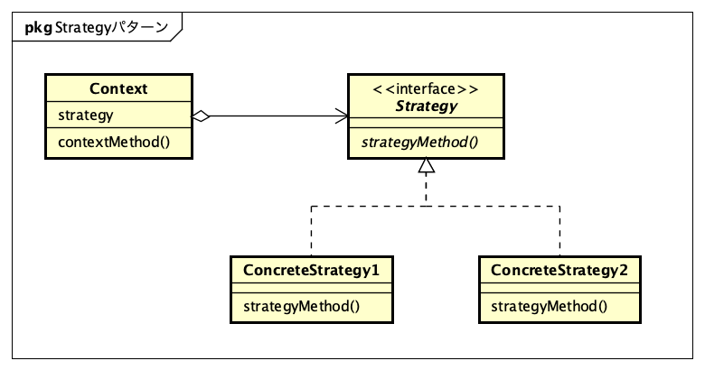

---
<!--
_footer: "" 
-->
Strategyパターンのまとめ

* アルゴリズムの切り替えを容易にする
* 動的にアルゴリズムを切り替えてもよい
* Strategyごとに開発メンバーをアサインし、パラレルで開発が進められたりできそう
* ソフトウェア設計だけではなく、ビジネスの戦略としても使えそう


# Composite
<!--
_footer: "" 
-->
* 参考資料1　章題　【容器と中身の同一視】
* 再帰的な構造を表現するのに便利なパターン

---
<!--
_footer: "" 
-->
Compositeパターンのサンプルプログラム例

* ディレクトリとファイルの構造を表示する
* 容器（ディレクトリ）と中身（ディレクトリまたはファイル）を同じように扱う
* ディレクトリの中にディレクトリを入れることができる。ディレクトリの中にはファイルを入れることもできる。
* ファイル作成時はサイズを指定する
* ディレクトリはディレクトリ配下にあるファイルの合計サイズを表示する
* ファイルはサイズを表示する

---
<!--
_footer: "" 
-->
Compositeパターンのサンプルプログラム例

つぎのファイルシステムをつくる（仮想のファイルシステムで実際にディレクトリ、ファイルをつくる訳ではない）。

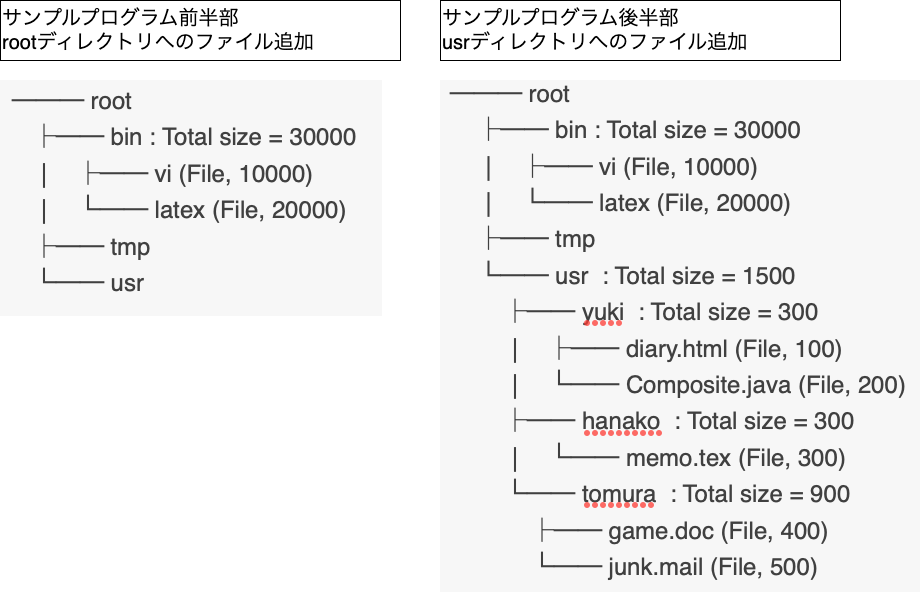


---
<!--
_footer: "" 
-->
サンプルプログラムのクラス図


サンプルプログラムのディレクトリ
https://github.com/grace2riku/design_pattern_lesson/tree/main/lesson_2/Composite


---
<!--
_footer: "" 
-->
サンプルプログラムのビルド方法
サンプルプログラムのディレクトリ（Main.javaがあるディレクトリ）に移動しつぎのコマンドでビルドする。

```
$ javac Main.java 
```

プログラムの実行はつぎのコマンドで行う。

```
$ java Main 
```

---
<!--
_footer: "" 
-->
Compositeサンプルプログラムの実行結果 その1
rootディレクトリのファイル追加はつぎの表示となる。

```
$ java Main
Making root entries...
/root (30000)
/root/bin (30000)
/root/bin/vi (10000)
/root/bin/latex (20000)
/root/tmp (0)
/root/usr (0)
```

---
<!--
_footer: "" 
-->
Compositeサンプルプログラムの実行結果 その2
usrディレクトリのファイル追加はつぎの表示となる。

```
Making user entries...
/root (31500)
/root/bin (30000)
/root/bin/vi (10000)
/root/bin/latex (20000)
/root/tmp (0)
/root/usr (1500)
/root/usr/yuki (300)
/root/usr/yuki/diary.html (100)
/root/usr/yuki/Composite.java (200)
/root/usr/hanako (300)
/root/usr/hanako/memo.tex (300)
/root/usr/tomura (900)
/root/usr/tomura/game.doc (400)
/root/usr/tomura/junk.mail (500)
```

---
<!--
_footer: "" 
-->
Compositeサンプルプログラムの実行結果 その3

usrディレクトリへのファイル追加でrootディレクトリのサイズが増えていることが確認できる。
（usrディレクトリはrootディレクトリ配下のディレクトリのため）

---
<!--
_footer: "" 
-->
サンプルプログラムの解説


---
<!--
_footer: "" 
-->
Compositeパターンの使いところ


# 参考資料
<!--
_footer: "" 
-->
1. [Java言語で学ぶデザインパターン入門　第3版](https://www.hyuki.com/dp/)
2. [直撃！デザインパターン](https://refactoring.guru/ja/design-patterns/book)
3. [ぼくにもわかるデザインパターン　第2章 GoFパターン大カタログ ～パターンがみるみる頭にしみこむ～](https://www.ulsystems.co.jp/archives/028.html)
4. [組込み分野のためのUML モデル解説書 部品編 C001 目標制御](https://umtp-japan.org/pdf/built/C001_TargetControl.pdf)

---

ご清聴ありがとうございました🙇