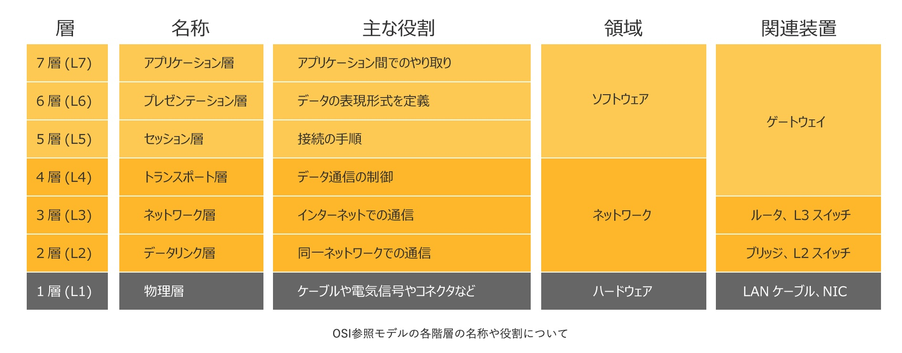
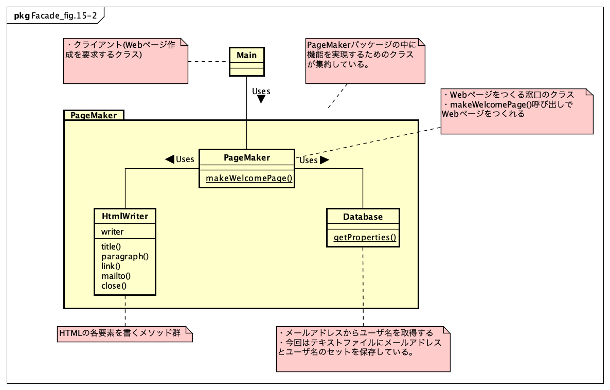
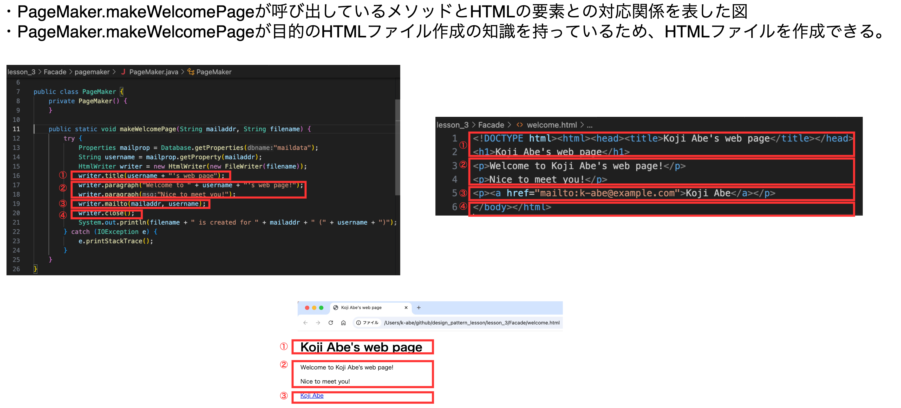

# 【連続講座3】デザインパターンを学び、ソフトウェア設計に生かそう
Facade・Observer・State

パーソルクロステクノロジー株式会社
エンジニアリング事業管掌　設計統括本部
第2電子・制御設計本部　第1設計部　4G　阿部耕二

<!--
_class: lead
_paginate: false
_header: ""
footer: ""
-->

# 目次
- 自己紹介
- 開発環境構築
- 設計、してますか?
- 良い設計とはどういう設計か?
- デザインパターンの学び方のススメ
- Facade
- Observer
- State
- 参考資料

<!--
_header: ""
_footer: "" 
-->

# 自己紹介
- 名前: 阿部　耕二（あべ　こうじ）
- 所属: パーソルクロステクノロジー株式会社
エンジニアリング事業管掌　設計統括本部
第2電子・制御設計本部　第1設計部　4G
- 医療機器の組込みソフトウェア開発。C言語。
- 趣味: 宇宙開発（[リーマンサットプロジェクト](https://www.rymansat.com/)広報メンバー）
- LAPRASポートフォリオ: https://lapras.com/public/k-abe
- Twitter: [@juraruming](https://x.com/juraruming)

# 開発環境構築
<!--
_footer: "" 
-->
サンプルコードのコンパイル、実行にjava（JDK）のインストールが必要です。
下記のページなどを参照し、ご自分のPCのOSに合わせてインストールしてください。

[【2024年版】Java JDKのインストール方法（Windows & Mac対応）](https://codeforfun.jp/how-to-install-java-jdk-on-windows-and-mac/)

---
<!--
_footer: "" 
-->
つぎのコマンド実行でバージョンが表示されていればOKです。
私はつぎのバージョンで確認しました。
```
$ javac -version
javac 17.0.8
```

---
<!--
_footer: "" 
-->
サンプルプログラムのビルド方法
サンプルプログラムのディレクトリ（Main.javaがあるディレクトリ）に移動しつぎのコマンドでビルドする。

```
$ javac Main.java 
```

プログラムの実行はつぎのコマンドで行う。
```
$ java Main 
```

---
<!--
_footer: "" 
-->
* 講座のGitHubリポジトリ
https://github.com/grace2riku/design_pattern_lesson

* 今回の講座のディレクトリ
https://github.com/grace2riku/design_pattern_lesson/tree/main/lesson_3

* 参考資料1　ソースコードのダウンロード先
[Java言語で学ぶデザインパターン入門　第3版](https://www.hyuki.com/dp/)


# 設計、してますか?
<!--
_footer: "" 
-->

**設計してますか?**

---
<!--
_footer: "" 
-->
こんなことになってませんか?


[おばあちゃんのプログラミング教室（ばあプロ）As A Service @Pythonist19](https://x.com/Pythonist19)より引用

https://x.com/Pythonist19/status/1845794841269055543

---
<!--
_footer: "" 
-->
* 設計の重要性
  * 要素技術にフォーカスしがち、注力しがち
  →　再利用しにくい、変更しにくいソフトウェアのできあがり
　
* 他社との違い・自社の強みを活かしていないソフトウェアが誕生
  * ビジネス競争力の低下　→　技術的負債に!!!

---
<!--
_footer: "" 
-->
* 設計の難しさ
  * お手本がない。
    * 対象製品、装置で個別の事情がある。
    * 製品の特性、開発期間、製品寿命、etc
      * Webシステムと組込みソフトウェア
      * 自動車と医療機器では設計思想も違ってきそう。
        * 自動車：変化が早い、開発期間短い、大量生産
        * 医療機器：開発期間長い印象、少量生産

  * ソフトウェアは柔軟で、自由度が高すぎる。

---
<!--
_footer: "" 
-->
* 対象システム、装置に応じた設計手法を学び、身につける
そしてチームメンバーと共通認識を持ちたい。

**デザインパターン**

* 設計の古典、教科書ともいえる。
* プログラミング言語の中に取り込まれて、見えない。
　
　→　学ぶことは意味があると考える。
　→　開発時のコミュニケーションに活用する。
　ここは「xxx」パターンを適用してみようか?

# 良い設計とはどういう設計か?
<!--
_footer: "" 
-->
良い設計のために個人的に大事だと思うキーワード

1. 凝集度
2. 結合度
3. 関心の分離

## 1. 凝集度
<!--
_footer: "" 
-->
* 関心ごとの集まり
* 凝集度が高い方（関心ごとが一箇所に集まっている）が良い設計と言われる
* 1つの目的・責務になっていることが望ましい

例）料理を作る場面
キッチン周りには料理に必要な設備が配置される（水道、冷蔵庫、コンロ、食器棚、その他）。
→必要なものが凝集している状態
キッチン周りに洗濯機はいらない。料理をつくるという関心ごとに洗濯機は不要。

## 2. 結合度
<!--
_footer: "" 
-->
* 他のモジュールとの関連の度合い
* 結合度が低い方（他のモジュールとの関連が少ない方）が良い設計と言われる
* あるファイルのグローバル変数が他の複数のファイルから参照されている状況は結合度が低い。

## 3. 関心の分離
<!--
_footer: "" 
-->
* 関心ごとを分離し、境界を設ける
* 関心の分離が表現されている例としてOSI参照モデル・TCP/IPに注目する

> 画像引用元
[OSI参照モデルとは？TCP/IPとの違いを図解で解説](https://www.itmanage.co.jp/column/osi-reference-model/)

---
<!--
_footer: "" 
-->


* 役割ごとに階層が分かれている
* 下の層がハードウェアに近い

---
<!--
_footer: "" 
-->


---
<!--
_footer: "" 
-->


* 上の階層ほど抽象的。目的・知識・Why。
* 下の階層ほど具体的。目的を達成する手段・How。

# デザインパターンの学び方のススメ
<!--
_footer: "" 
-->
* デザインパターンがどんな課題を解決できて、どのような構成なのかイメージを捉える
  * 参考資料1の章題はデザインパターンを短く端的に表現している。
  * 参考資料3では各デザインパターンを短く、わかりやすく解説してくれている。

---
<!--
_footer: "" 
-->
* クラス図とコードの写経をセットで行う
  * コードだけ見ていても各クラスの全体の関係性がわかりずらい。クラス図だけを見ていても抽象的で本当に動くのか疑問がわく。

  * 設計図（抽象）　⇔　コード（具体的）の世界を行ったり来たりすることで整理できたり、気づきが得られることがあると思う。

  * 今回のサンプルコードはJava。デザインパターンの考え方・実装は特定のプログラミング言語に限定されないと思うので自分が得意な言語で実装してみると理解が深まると思う。
  参考資料2ではC#、 C++、 Go、 Java、 PHP、 Python、 Ruby、 Rust、 Swift、 TypeScriptで実装例を提示してくれている。

---
<!--
_footer: "" 
-->
* デザインパターンに登場するクラスの相互関係に注目する
  * 複数のクラスが関係してパターンを構成している。各クラスの役割、関係性に注目する。

* デザインパターンがどのように振る舞うか?に加えて、デザインパターンはどのように使われるか?の視点も大事だと思う。

# Facade
<!--
_footer: "" 
-->
* 参考資料1　章題　【シンプルな窓口】
* Facadeのクラスはクラインアントにシンプルな処理の窓口を提供する。
* Facadeのクラスはシステム内部のクラスを正しく利用する（システム内部のクラスの依存関係を理解・把握し、正しい処理の順番で実行する）。システム内部のごちゃごちゃをクライアントに見せない。

---
<!--
_footer: "" 
-->
サンプルプログラム例
テーマ：参考資料1のWebページ（ユーザ名を表示するシンプルなもの）を作成するプログラム。
Webページは以下の構造を持つ。
* タイトル
* 段落
* リンク
* メールアドレスのリンク


---
<!--
_footer: "" 
-->
サンプルプログラムのクラス図



サンプルプログラムのディレクトリ

https://github.com/grace2riku/design_pattern_lesson/tree/main/lesson_3/Facade

---
<!--
_footer: "" 
-->
サンプルプログラムのビルド方法
サンプルプログラムのディレクトリ（Main.javaがあるディレクトリ）に移動しつぎのコマンドでビルドする。

```
$ javac Main.java 
```

プログラムの実行はつぎのコマンドで行う。
```
$ java Main 
```

---
<!--
_footer: "" 
-->
サンプルプログラムの実行結果

```
$ java Main
welcome.html is created for k-abe@example.com (Koji Abe)
```

welcome.htmlの内容
```html
<!DOCTYPE html><html><head><title>Koji Abe's web page</title></head>
<h1>Koji Abe's web page</h1>
<p>Welcome to Koji Abe's web page!</p>
<p>Nice to meet you!</p>
<p><a href="mailto:k-abe@example.com">Koji Abe</a></p>
</body></html>
```

---
<!--
_footer: "" 
-->
welcome.htmlをブラウザで表示したところ


---
<!--
_footer: "" 
-->
サンプルプログラムの解説



---
<!--
_footer: "" 
-->
Facadeパターンの登場人物を抽象的に書く


---
<!--
_footer: "" 
-->
Facadeパターンのまとめ

* システム内部の複雑さを単純にできる
* シンプルな窓口を提供する→外部との結合が疎になる→部品として再利用できる


# Observer
<!--
_footer: "" 
-->
* 参考資料1　章題　【状態の変化を通知する】
* observerは、観察(observe)する人、観察者という意味とのこと
* 観察対象の状態が変化したことを観察者に通知する。状態変化に応じた処理を記述するときに便利
* Publish-Subscribeパターン（出版-購読）と呼ばれることもあるらしい。

---
<!--
_footer: "" 
-->
ROS2のPublish-Subscriber通信
> https://docs.ros.org/en/humble/Tutorials/Beginner-CLI-Tools/Understanding-ROS2-Topics/Understanding-ROS2-Topics.html


---
<!--
_footer: "" 
-->
サンプルプログラムの例
テーマ: 数(0〜49のランダムな整数を20個)をObserverに通知する。通知を受けたObserverはそれぞれの方法で数を表示する。
* Observer 1. DigitObserverは数字で数を表示する
* Observer 2. GraphObserverはグラフ(*)で数を表示する


---
<!--
_footer: "" 
-->
サンプルプログラムのクラス図


サンプルプログラムのディレクトリ
https://github.com/grace2riku/design_pattern_lesson/tree/main/lesson_3/Observer

---
<!--
_footer: "" 
-->
サンプルプログラムのビルド方法
サンプルプログラムのディレクトリ（Main.javaがあるディレクトリ）に移動しつぎのコマンドでビルドする。

```
$ javac Main.java 
```

プログラムの実行はつぎのコマンドで行う。
```
$ java Main 
```

---
<!--
_footer: "" 
-->
サンプルプログラムの実行結果
DigitObserverとGraphObserverの表示の組が20個あるが省略

```
$ java Main
DigitObserver:9
GraphObserver:*********
DigitObserver:13
GraphObserver:*************
DigitObserver:30
GraphObserver:******************************
DigitObserver:23
GraphObserver:***********************
DigitObserver:34
GraphObserver:**********************************
```

---
<!--
_footer: "" 
-->
サンプルプログラムの解説


---
<!--
_footer: "" 
-->
Observerパターンのまとめ

* 状態変化を通知するときに使うと便利なパターン
* 通知を出す側はObserverのことを知らない。RandomNumberGeneratorはObserverがDigitObserverかGraphObserverか知らない。
* Observerは通知を出す側を知らない。DigitObserver・GraphObserverはRandomNumberGeneratorが通知を出していることを知らない。
→知らないということはクラスを交換できる→変更容易性を高める設計ができる


# State
<!--
_footer: "" 
-->
* 参考資料1　章題　【状態をクラスとして表現する】
* クラスを切り替えると状態の変化を表せる→どんな良いことがあるかは後述します

---
<!--
_footer: "" 
-->
Stateパターンのサンプルプログラム例
テーマ：参考資料1の金庫警備システム


---
<!--
_footer: "" 
-->
サンプルプログラムのクラス図


サンプルプログラムのディレクトリ
https://github.com/grace2riku/design_pattern_lesson/tree/main/lesson_3/State


---
<!--
_footer: "" 
-->
サンプルプログラムのビルド方法
サンプルプログラムのディレクトリ（Main.javaがあるディレクトリ）に移動しつぎのコマンドでビルドする。

```
$ javac Main.java 
```

プログラムの実行はつぎのコマンドで行う。
```
$ java Main 
```

---
<!--
_footer: "" 
-->
Stateサンプルプログラムの実行結果

```
$ java Main
```

---
<!--
_footer: "" 
-->
Stateパターンの使いところ


# 参考資料
<!--
_footer: "" 
-->
1. [Java言語で学ぶデザインパターン入門　第3版](https://www.hyuki.com/dp/)
2. [直撃！デザインパターン](https://refactoring.guru/ja/design-patterns/book)
3. [ぼくにもわかるデザインパターン　第2章 GoFパターン大カタログ ～パターンがみるみる頭にしみこむ～](https://www.ulsystems.co.jp/archives/028.html)


---

ご清聴ありがとうございました🙇